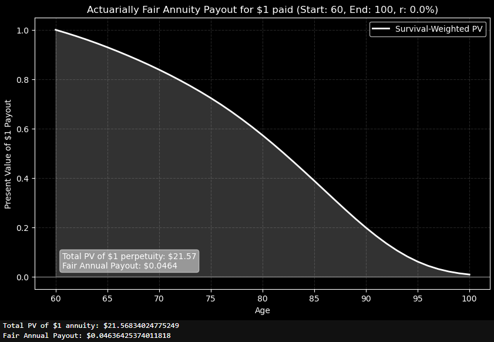
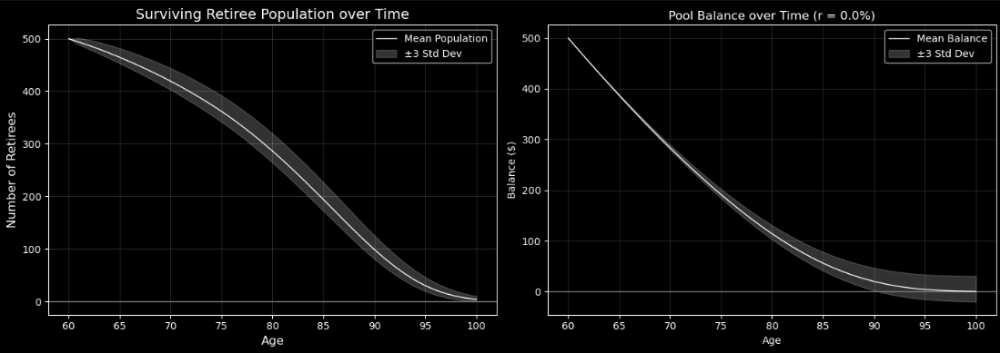
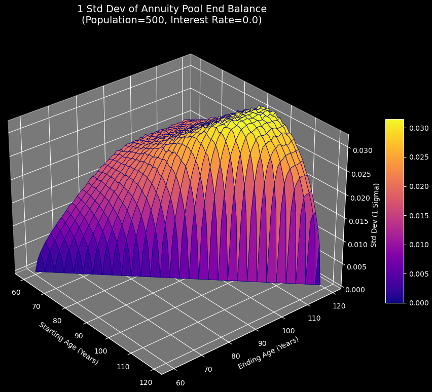
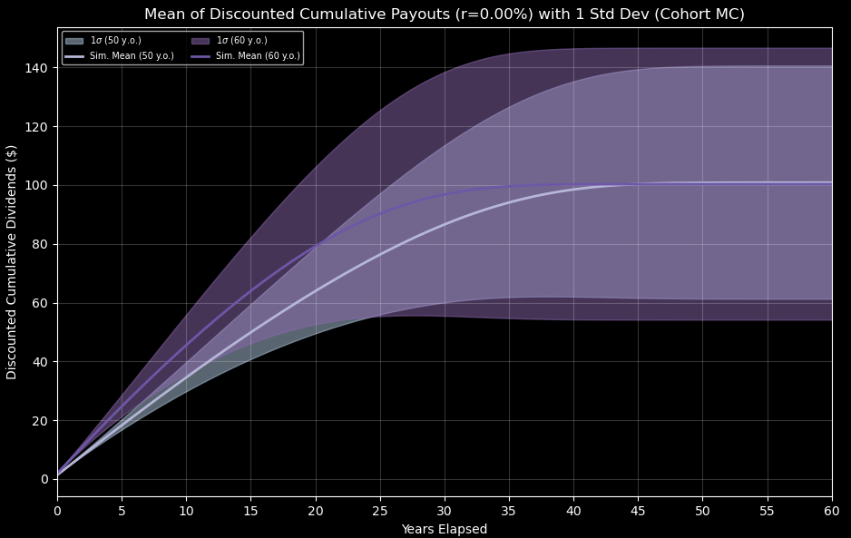
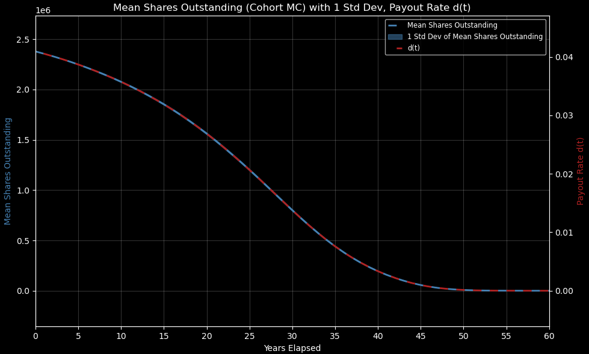
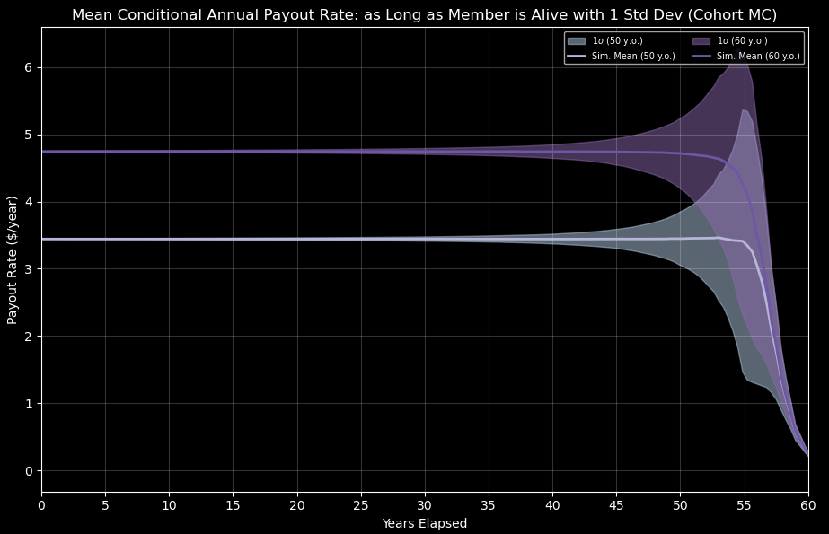

# Fair Tontine Toolbox

Jupyter notebooks that price equitable participation rates (π) for mixed-cohort retirement tontines, with visuals and simulations built on Milevsky & Salisbury (2016).

**Disclaimer:** This project is for research and educational purposes only. It is not financial, investment, or actuarial advice.

## Example results

Pre-rendered outputs from the notebooks. You can view them here without running anything.

Survival-weighted present value of a $1 payout, ages 60–100, r = 0% (fair annual payout ≈ $0.046):



Annuity-pool Monte Carlo: surviving population and pool balance with ±3σ bands:



1σ of end balance vs start/end age (N = 500, r = 0%):



Mixed 50- and 60-year-old cohorts (20,000 members): mean discounted cumulative payouts ±1σ:



Same pool: mean shares outstanding and payout rate d(t):



Same pool: conditional annual payout while alive ±1σ:



[Full plot gallery](docs/RESULTS.md)

## Why I built this

While looking for projects for a quant-focused portfolio, I came across tontines. At first glance they looked like a peculiar scheme: you benefit when others in the pool die. That shocked me at first and pushed me to read further.

A deeper dive changed the picture. Modern tontine design is less about morbid speculation and more about pooling longevity risk efficiently. I discovered it to be a potential key to **freeing up billions in pension funds reserves.**
## What this project does

This toolbox addresses a concrete problem from historical tontines: **unfairness when different ages and stake sizes share one pool**. It implements a **participation-rate (π) pricer** for a heterogeneous client base—who pays a premium or discount per share so that mixed cohorts can pool without discriminating by age or investment size.

It also turns dense, math-heavy academic work into something you can **run, plot, and stress-test** in notebooks—so the mechanics of equitable pooling are easier to grasp than from the paper alone.

## What I learned

You should not dismiss an idea because of a bad first impression, or because it is old (tontines date to the 17th century). The real question is whether the it can solve a real problem today.

## Requirements

- Python 3.10+
- Dependencies: `pip install -r requirements.txt`

## How to run

Open Jupyter from the project root (imports assume the working directory is the repo root):

```bash
jupyter notebook
```

Suggested notebook order:

1. `TontineToolboxQXVisualizer.ipynb` — sanity-check mortality tables (empirical qx vs. Gompertz from the paper)
2. `TontineToolboxAnnuity.ipynb` — fair annuity payouts and pool volatility (baseline before tontine mechanics)
3. `TontineToolboxMain.ipynb` — core π solvers and pool simulation
4. `TontineToolboxOutlierMath.ipynb` — replicate Milevsky & Salisbury outlier curves (optional, paper-focused)

## References

### Mortality data

U.S. Social Security Administration, Period Life Table 4C6 (2021 period, as used in the 2024 Trustees Report).  
https://www.ssa.gov/oact/STATS/table4c6.html

### Academic sources

This repository implements and extends the framework in:

> Milevsky, M. A., & Salisbury, T. S. (2016). *Equitable Retirement Income Tontines: Mixing Cohorts Without Discriminating.* ASTIN Bulletin, 46(3), 571–604.  
> [Cambridge](https://www.cambridge.org/core/journals/astin-bulletin-journal-of-the-iaa/article/equitable-retirement-income-tontines-mixing-cohorts-without-discriminating/3174FE869098E8E47A738CC1C2E06A86) · [SSRN](https://ssrn.com/abstract=2700362)

Related (natural tontine / Gompertz parameters used in the QX visualizer):

> Milevsky, M. A., & Salisbury, T. S. (2015). *Optimal Retirement Income Tontines.* Insurance: Mathematics and Economics, 64, 91–105.

This project is **not affiliated with or endorsed by** the authors.

## License

MIT License — see [LICENSE](LICENSE). Mortality data is U.S. government data; cite SSA as the source when redistributing.
