# Plot gallery

Pre-rendered outputs from the Fair Tontine Toolbox notebooks. Highlight plots also appear on the [README](../README.md).

## Mortality inputs

Empirical SSA period life table (qx) vs. the Gompertz model from the paper, linear scale:

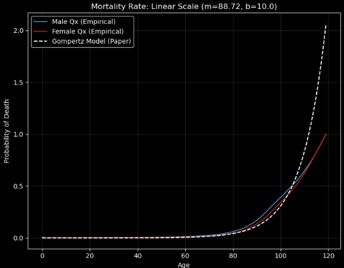

Same comparison on a log scale:

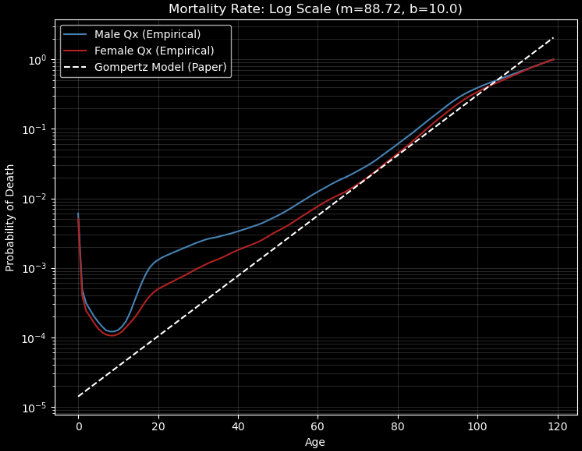

Mortality tables as Python lists (`MALE_QX`, `FEMALE_QX`):

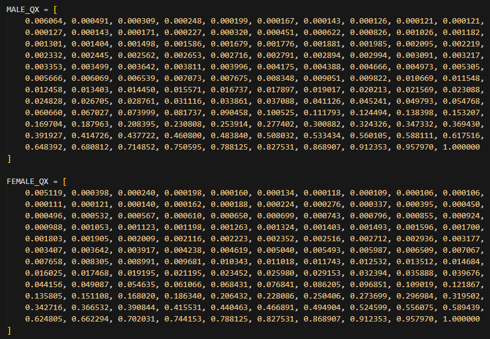

## Annuity baseline

Survival-weighted present value of a $1 payout, ages 60–100, r = 0% (fair annual payout ≈ $0.046):

Annuity-pool Monte Carlo: surviving population and pool balance with ±3σ bands:

1σ of end balance vs start/end age (N = 500, r = 0%):

## Mixed-cohort tontine (20,000 members)

50- and 60-year-old cohorts sharing one pool. Mean discounted cumulative payouts ±1σ:

Mean shares outstanding and payout rate d(t):

Conditional annual payout while alive ±1σ:

## Pool-size comparison

Larger pools compress payout volatility. Each size shows the same three views: discounted cumulative payouts, shares outstanding + d(t), and conditional annual payout while alive.

### Homogeneous 60-year-old cohort

**100 members**

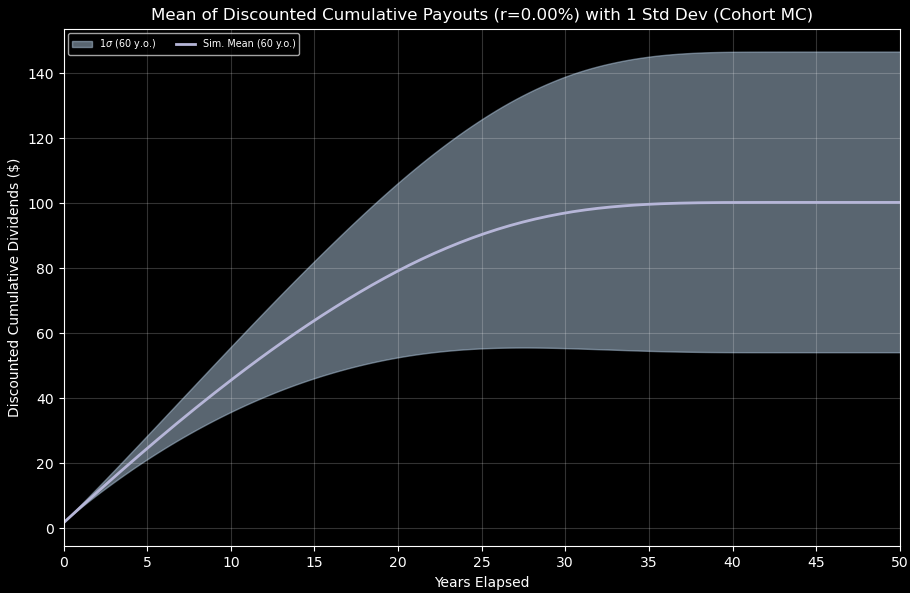

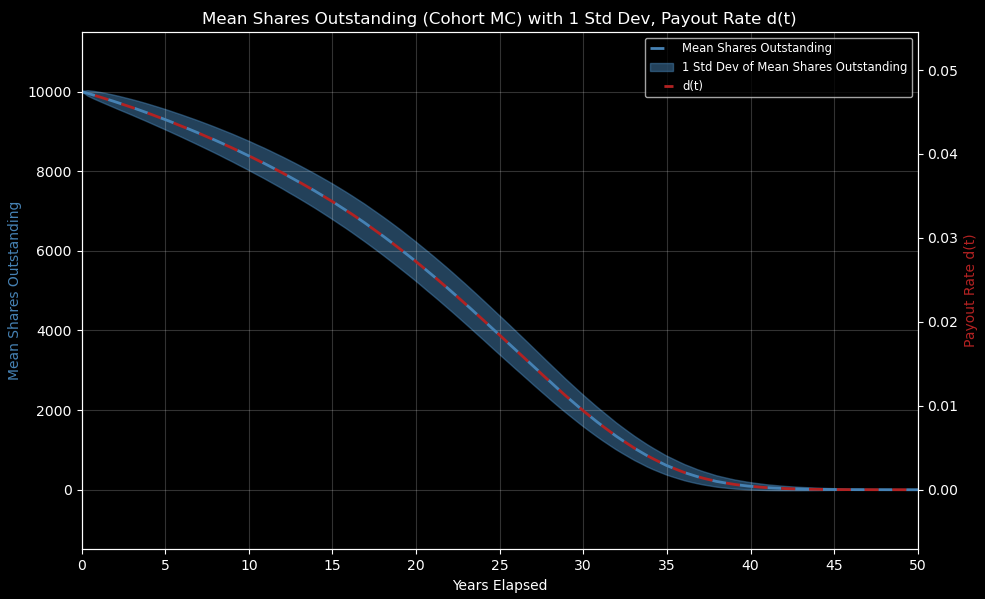

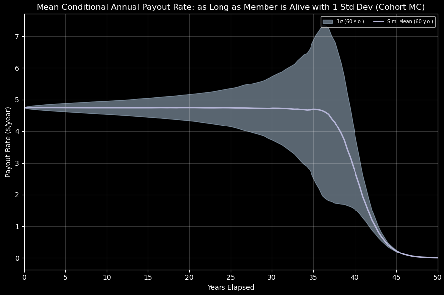

**1,000 members**

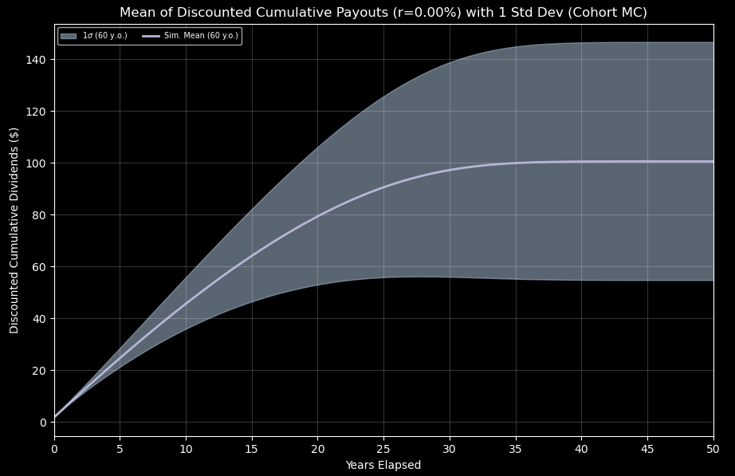

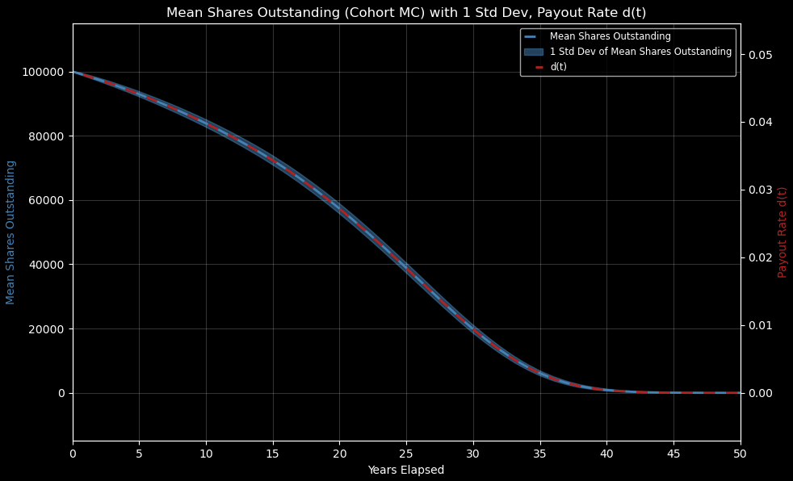

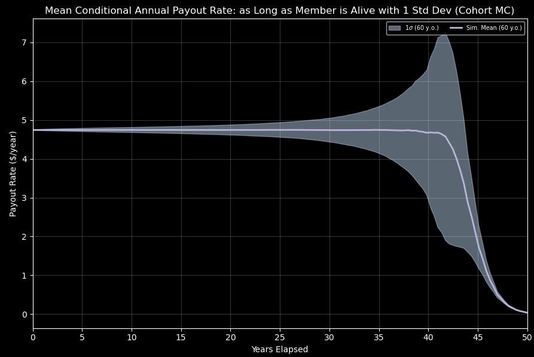

**10,000 members**

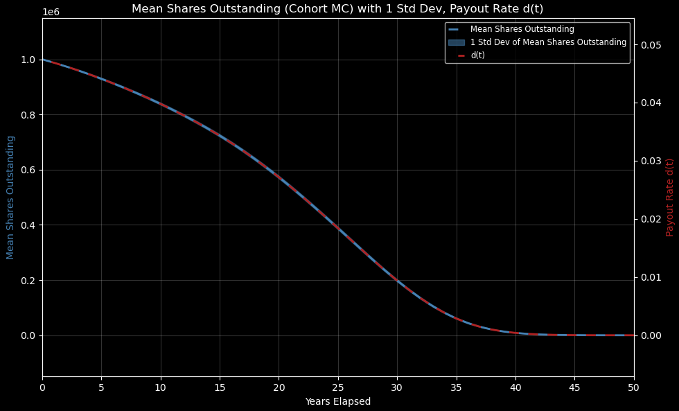

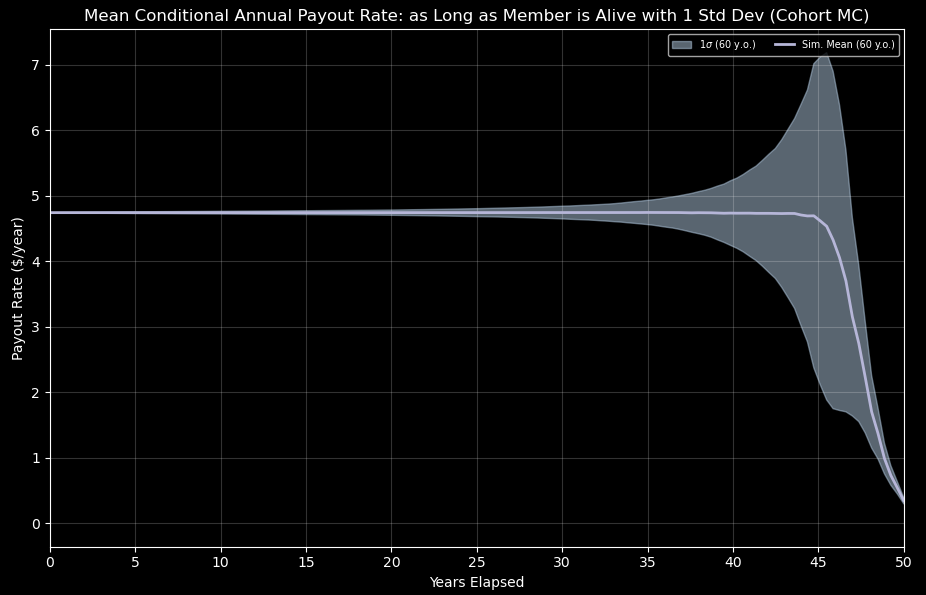

### Mixed 50- and 60-year-old cohorts

**200 members**

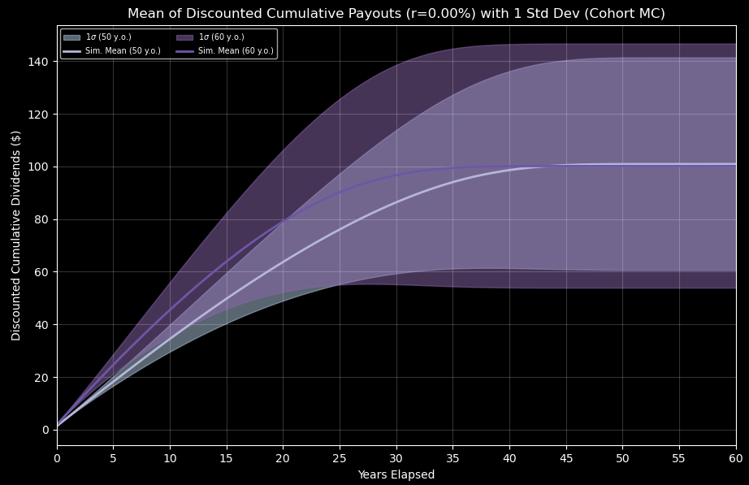

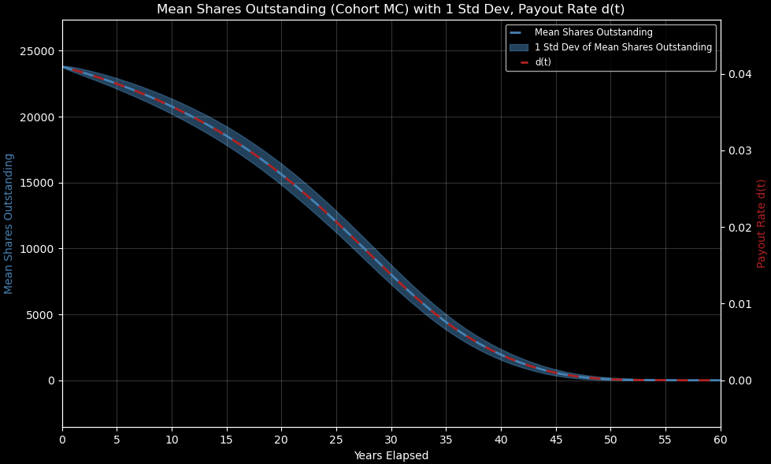

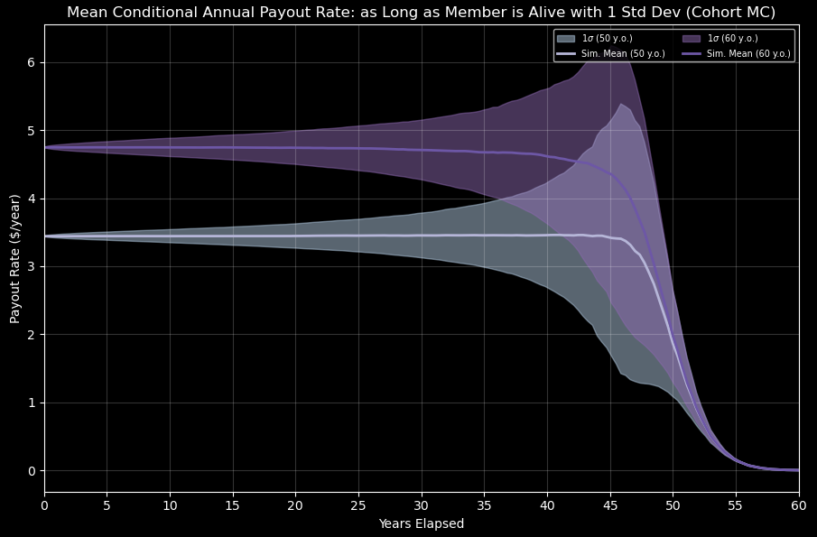

**2,000 members**

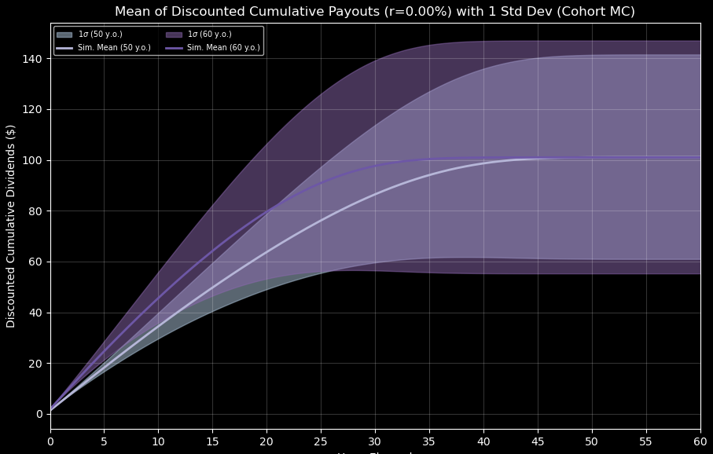

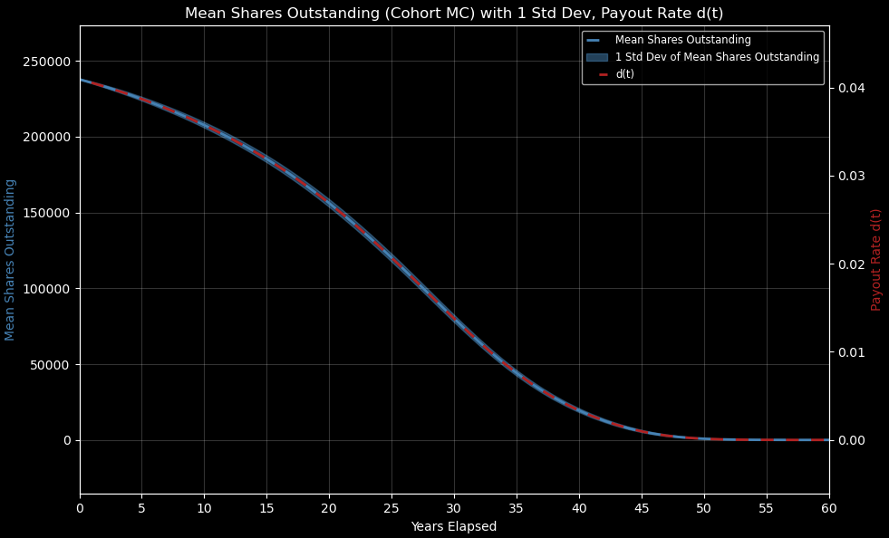

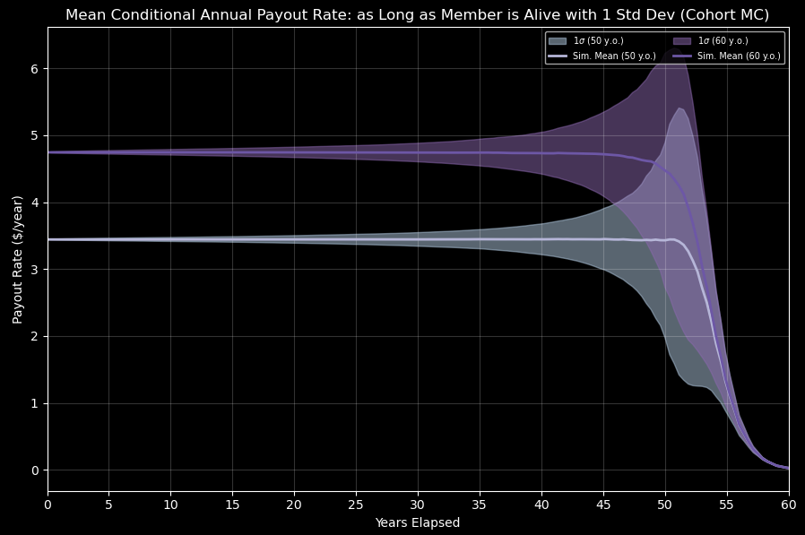

**20,000 members** (same three charts as in the section above)

## Outlier / π analysis

Participation rate (π) for a single outlier vs. an age-60 cohort, by cohort size and outlier age:

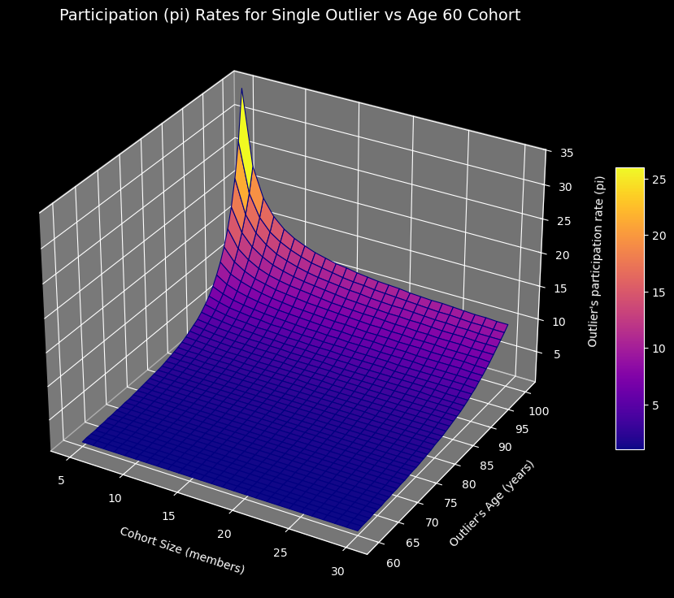

Participation rate for a 75-year-old outlier vs. a homogeneous age-65 cohort, by cohort size and outlier investment:

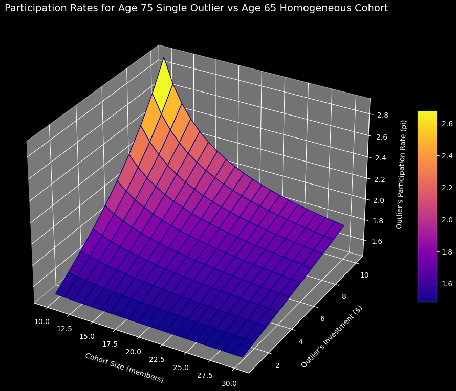
